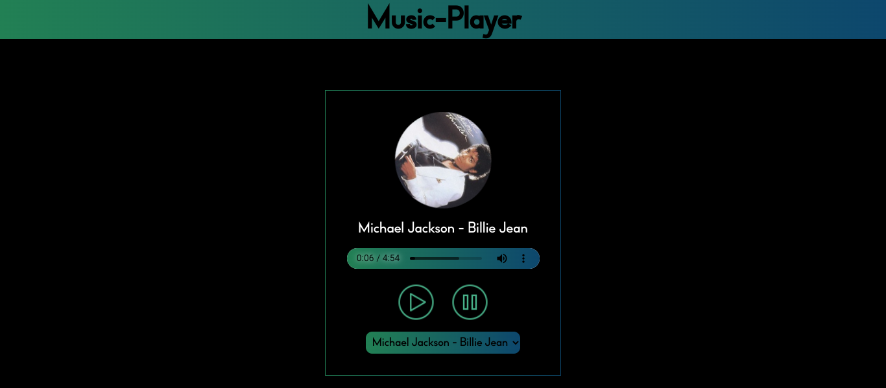

<h1 align="center"> Music-player com JavaScript </h1>

<h2 align="center">Um music-player simples feito com Javascript puro</h2>

<h2> ➢ O que é esse projeto? </h2>

 
  Este projeto foi feito com o objetivo de treinar novos eventos DOM do Javascript.
  Como é um treino simples, o código está bem amador, então... Relevem kkk 

  Você pode acessar o site clicando neste link: https://quimicafacil.vercel.app

<h3> ➢ Outras informações </h3>
<ul>
  <li> <strong>Status:</strong> <em>Finalizado</em>
  <li> <strong>Linguagens utilizadas:</strong>  
    

             
        
      
    

  <li> <strong>Conhecimentos aplicados:</strong>
  <ul>
    <li> <em>CSS Custom Properties</em>
    <li> <em>Media Queries</em>
    <li> <em>JavaScript DOM</em>
  </ul>
</ul>
